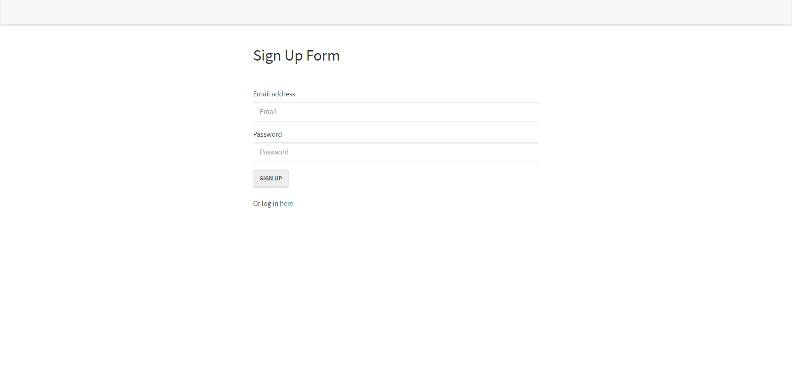

# homework_14_reverse_engineering_authentication

## Description

In this assignment, we were challenged to review and reverse engineer the provided started code to create a tutorial for users.

```
AS A developer

I WANT a walk-through of the codebase

SO THAT I can use it as a starting point for a new project
```

## Installation

To use application run an npm install and use node to run application - please see link to google doc for further instructions 

## Usage

Not Applicable 

## Technologies Used
```
NPM -
    "bcryptjs": "2.4.3",
    "express": "^4.17.0",
    "express-session": "^1.16.1",
    "mysql2": "^1.6.5",
    "passport": "^0.4.0",
    "passport-local": "^1.0.0",
    "sequelize": "^5.8.6"
```

## Problems I faced

This was a very difficult assignment 

## Credits

Ryan Witherspoon

## Image


## Links
[Link to GitHub!](https://github.com/ryanwit/homework_14_reverse_engineering_authentication)

[Link to Google Document!](https://mighty-brushlands-34914.herokuapp.com/)


# License
